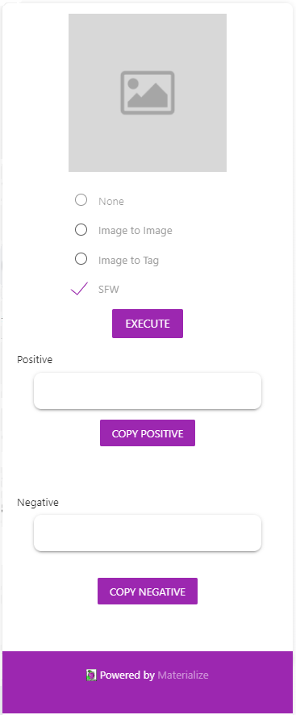
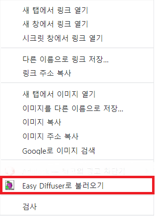
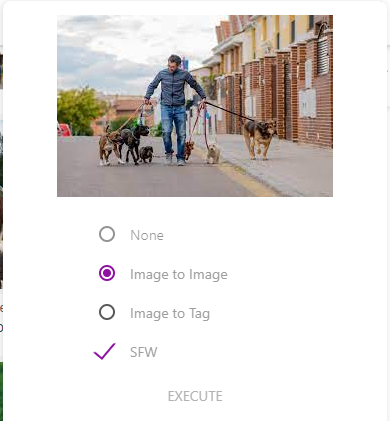
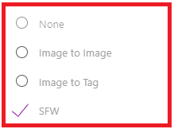
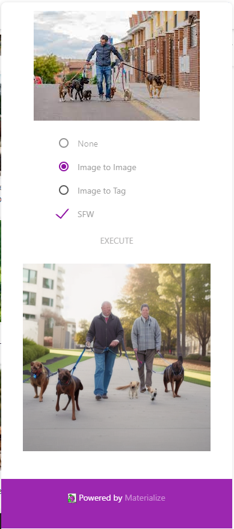
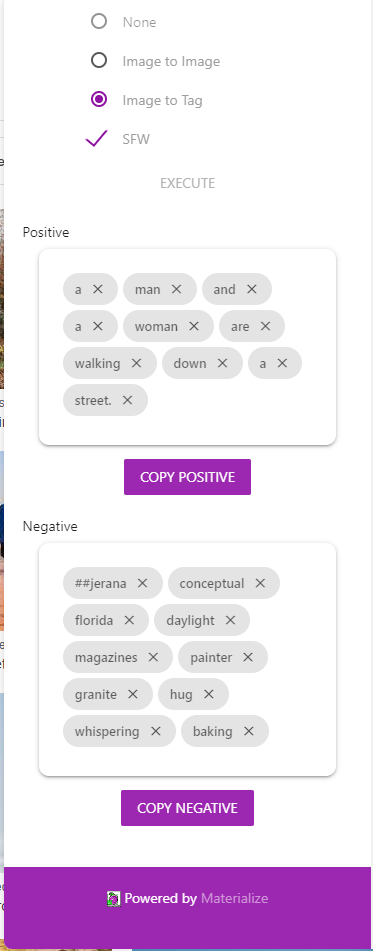
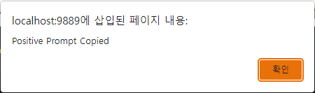
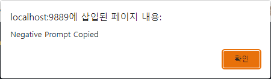

# Easy Diffuser / Chrome Extension

{Logo}

[README_KOR](./README_KOR.md)

Easy Diffuser / Chrome Extension is a chrome extension that handles user interaction. The chrome extension sends image to ML model, gets images or tokens as response to support Stable Diffusion users.

# Table of Contents

1. [Features](#features)
2. [Installation](#installation)
3. [Getting Started](#getting-started)
4. [Support and Feeback](#support-and-feedback)
5. [About Easy Diffuser](#about-easy-diffuser)
6. [Licenses](#licensed)

---

## Features

The chrome extension itself is built with React using *https://github.com/segmentio/chrome-sidebar* and it only holds side bar function. Technically, the extension supports sidebar that provides iframe view of a page and function that imports image from menu. This implementation can be found in _./dist_ directory.

A single page application inside chrome extension supports main logic of functions for UI of Easy Diffuser. This implementation can be found in _./local_ directory.

The single page application is handled by server.py in _./local_ and supports GET (serves html) and POST (import image to the application) methods.

#### User Interface



This is the UI of the chrome extension. The UI is implemented simple html, css, and javascript. The style of UI elements followed that of Material theme and used Materialize CSS for style.

**Import an image**



When right-clicking on the image in any webpage, the menu will show 'Import to Easy Diffuser' button. This button imports image into Easy Diffuser chrome extension.



This function is implemented by sending http POST request from chrome extension to page application. This implementation is in _./dist/main.js_ as below:

```javascript
sendToEasyDiffuser = async function (context) {
  var imageUrl = context.srcUrl;

  const Url = "http://127.0.0.1:9889";

  const response = await fetch(Url, {
    headers: {
      "content-type": "text/plain",
    },
    body: imageUrl,
    method: "POST",
  });

  return response.json();
};

chrome.contextMenus.create({
  title: "Easy Diffuser로 불러오기",
  contexts: ["image"], // ContextType
  onclick: sendToEasyDiffuser, // A callback function
});
```

**Choose a feature by selecting a radio button**



By selecting radio button, user can use either 'Image to Image' or 'Image to Tag' function. Checkbox under radio buttons enables filtering sexual contents when using functions, and it is set to be filtered by default.

**Execute Button**


By clicking execute button, easy diffuser runs selected function and exports result.

**Loader**


When function is running, circular loader rotates until the result is outputted.

**Img2Img Result**



Img2Img result is shown below the button, as a form of an image. The image is saved in _./output_ directory.

**Img2Tag Result**



Img2Tag result is shown below the button, as having cards for each tokens in positive and negative prompt. By clicking 'x' on each cards, tags are deleted and not included in copy.

**Copying Resulted Tags**

By clicking 'Copy Positive' and 'Copy Negative' buttons, tags can be easily copied. As each results are copied, alert message shows as the copy succeeded.





---

## Installation

1. Move to `chrome://extensions/` page
2. Toggle 'Developer Mode' button on right-top of the page
3. Import chrome extension in _./dist_

## Getting Started

1. run local with http server

```bash
cd local
python server.py
```

2. open chrome extension by clicking button
3. Find any image on web. By right clicking on the image, you can easily import image to the extension by clicking import-image button.
4. Select either Image to Image or Image to Tag function.
5. Click execute button.
6. Receive results and use it as you want.

---

## Support and Feedback

Easy Diffuser is implemented by [박찬호](https://github.com/charlieppark), [허찬용](https://github.com/H-ChanY).

If there's any need for support or feedback, feel free to add issues in the corresponding repository.

Or you can freely contact via email:

박찬호 : chanho.park@dankook.ac.kr

허찬용 : yong5835@gmail.com

---

## About Easy Diffuser

Easy Diffuser was developed to address the following issues:

1. Users spend a lot of time generating diffusion images.
2. Repeated generation of diffusion images consumes a lot of computing resources and power.
3. It is difficult to share the experience of the image generation process among users.

To solve these problems, Easy Diffuser provides the following two functions:

1. Extraction of generation conditions from a reference image:

   - Users can load a reference image and extract generation conditions. Easy Diffuser converts the input image into text using OpenAI's CLIP and translates it into tag combinations using a transformer-based translator. The resulting tag combinations can be used as inputs for `txt2img` in the WebUI.

2. Image-to-image generation using a reference image:

   - The existing image-to-image generation functionality requires users to go through steps such as finding, saving, and loading images, or using images generated with `txt2img`. Easy Diffuser provides a convenient menu to directly load images from web pages into the WebUI's `img2img` generation.

---

## Licenses

{link to licenses file}
