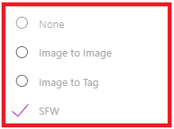
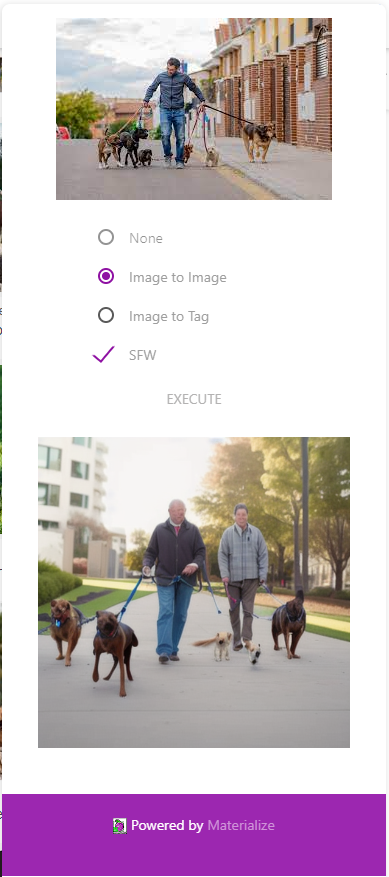
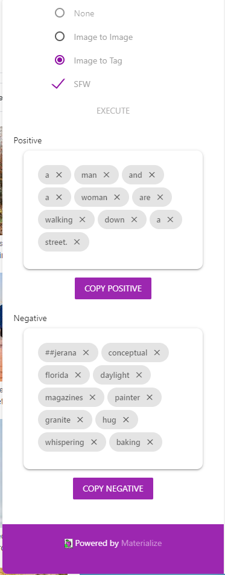
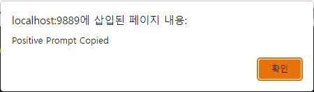

# Easy Diffuser / Chrome Extension

{Logo}

Easy Diffuser / Chrome Extension 은 유저와의 상호작용을 담당하는 크롬 확장프로그램입니다. 이 크롬 확장프로그램은 ML 모델로 이미지를 보내고, 결과로 이미지 또는 토큰을 전달받아 Stable Diffusion 사용자를 돕는 것을 목저긍로 합니다.

# Table of Contents

1. [Features](#features)
2. [Installation](#installation)
3. [Getting Started](#getting-started)
4. [Support and Feeback](#support-and-feedback)
5. [About Easy Diffuser](#about-easy-diffuser)
6. [Licenses](#licensed)

---

## Features

이 크롬 확장프로그램은 React로 빌드되었으며, 사이드바 기능을 위해 *https://github.com/segmentio/chrome-sidebar* 를 사용하였습니다. 엄밀하게, 이 크롬 확장프로그램은 내부에 iframe으로 페이지를 보여주는 사이드바 기능과 우클릭 메뉴로부터 내부 페이지로 이미지를 보내는 기능으로 구성되어 있습니다. 이 구현은 _./dist_ 에서 확인할 수 있습니다.

이 크롬 확장프로그램이 호스팅하는 내부의 단일 페이지 앱은 Easy Diffuser의 UI와 메인 로직을 담당하고 있습니다. 구현은 _./local_ 에서 확인할 수 있습니다.

이 단일 페이지 앱은 _./local_ 경로의 server.py로 핸들링되고, GET (html 전달) 과 POST (앱으로 이미지 불러오기) 메소드를 지원합니다.

#### User Interface


위의 이미지는 본 크롬 확장프로그램의 UI입니다. UI는 html, css, 그리고 javascript를 사용하여 구현하였습니다. UI 요소의 스타일은 Material 테마를 따랐으며, 이를 위해 Materialize CSS를 사용하였습니다.

**Import an image**


어떤 웹페이지에서는 이미지에 우클릭을 하면, 위와 같은 메뉴를 확인할 수 있습니다. Easy Diffuser로 불러오기를 클릭하면, 크롬 확장프로그램으로 이미지를 불러옵니다.


이미지는 크롬 확장프로그램이 단일 페이지 앱으로 POST 요청을 보냄으로써 불러와집니다. 이는 _./dist/main.js_ 에 구현되어 있으며 아래와 같은 코드로 구현되어 있습니다:

```javascript
sendToEasyDiffuser = async function (context) {
  var imageUrl = context.srcUrl;

  const Url = "http://127.0.0.1:9889";

  const response = await fetch(Url, {
    headers: {
      "content-type": "text/plain",
    },
    body: imageUrl,
    method: "POST",
  });

  return response.json();
};

chrome.contextMenus.create({
  title: "Easy Diffuser로 불러오기",
  contexts: ["image"], // ContextType
  onclick: sendToEasyDiffuser, // A callback function
});
```

**Choose a feature by selecting a radio button**



라디오 버튼을 선택함으로써 유저는 'Image to Image' 또는 'Image to Tag' 기능을 선택할 수 있습니다. 라디오 버튼 아래의 체크박스는 기능 사용에 있어 선정적 콘텐츠 필터링 여부를 선택할 수 있습니다. 초기값은 필터링 적용으로 정해져 있습니다.

**Execute Button**


실행버튼을 클릭하면, Easy Diffuser가 선택한 기능을 수행합니다.

**Loader**


기능 수행이 끝날 때까지 원형의 Loader가 회전합니다.

**Img2Img Result**



Img2Img 결과는 버튼 아래에 이미지의 형태로 표시됩니다. 이 이미지는 _./output_ 에 저장됩니다.

**Img2Tag Result**



Img2Tag 결과는 버튼 아래에 출력되며, 긍정 프롬프트와 부정 프롬프트로 나뉘어 카드의 형태로 출력됩니다. 카드의 x를 클릭하면 태그는 지워지고, 해당 태그는 복사 시에 배제됩니다.

**Copying Resulted Tags**

'Copy Positive' 와 'Copy Negative' 버튼을 클릭하면 태그를 쉽게 복사할 수 있으며, 복사 성공 시에 alert message가 출력됩니다.




---

## Installation

1. `chrome://extensions/` 페이지로 이동합니다
2. 우상단의 '개발자 모드'를 켭니다/
3. 압축해제된 확장 프로그램을 로드합니다에서 _./dist_ 를 불러옵니다.

---

## Getting Started

1. 아래의 명령을 실행하여 로컬 서버를 켭니다.

```bash
cd local
python server.py
```

2. 크롬 확장프로그램 탭에서 버튼을 클릭하여 앱을 엽니다.
3. 웹에서 이미지를 찾고, 이미지에 우클릭하여 메뉴를 엽니다. 메뉴에서 Easy Diffuser로 불러오기를 클릭하여 이미지를 불러옵니다.
4. Image to Image 또는 Image to Tag 기능을 선택합니다.
5. Execute 버튼을 클릭합니다.
6. 결과를 확인하고 사용합니다.

---

## Support and Feedback

Easy Diffuser is implemented by [박찬호](https://github.com/charlieppark), [허찬용](https://github.com/H-ChanY).

If there's any need for support or feedback, feel free to add issues in the corresponding repository.

Or you can freely contact via email:

박찬호 : chanho.park@dankook.ac.kr

허찬용 : yong5835@gmail.com

---

## About Easy Diffuser

### Easy Diffuser는 아래와 같은 문제 사항들을 해결하기 위해 개발이 되었습니다.

#### 1. diffusion 이미지 생성을 위해 사용자는 많은 시간을 소모해야 한다.

#### 2. 둘째로, 반복된 diffusion 이미지 생성은 많은 컴퓨팅 자원과 전력을 소모한다

#### 3. 이미지 생성 과정의 경험이 사용자 간에 공유되기 어렵다.

해당 문제를 해결하기 위해 저희 Easy Diffuser는 아래와 같은 2가지 기능을 수행합니다.

    1.	Reference 이미지로부터 생성 조건을 추출하는 기능
    사용자는 Reference 이미지를 불러와 추출 기능을 작동시킨다. Easy Diffuser는 입력된 이미지를 OpenAI의 CLIP을 거쳐 텍스트로 변환하고, transformer 기반의 번역기를 사용해 태그 조합으로 번역을 수행한다. 결과물로 도출된 태그 조합은 사용자가 WebUI에서 txt2img의 입력으로 사용할 수 있다.

    2.	Reference 이미지를 입력하여 img2img 생성을 수행하는 기능
    기존의 img2img 생성 기능은 사용자가 이미지를 찾고, 저장하고, 불러오는 등의 단계를 거쳐 동작하거나, txt2img로 생성한 이미지를 불러와 사용할 수 있었다. Easy Diffuser는 웹 페이지의 이미지를 바로 WebUI의 img2img 생성으로 불러올 수 있도록 간편한 메뉴를 지원한다.

---

## Licenses

[GPL 3.0 License](./LICENSE)
